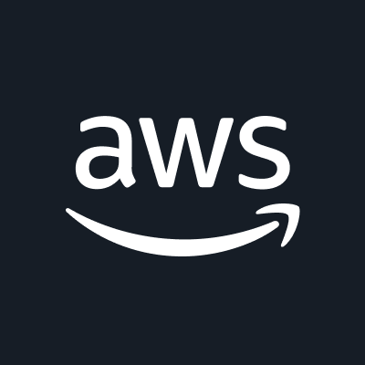
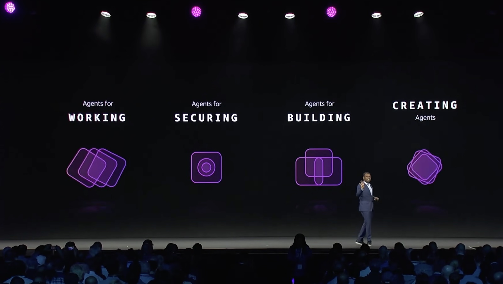
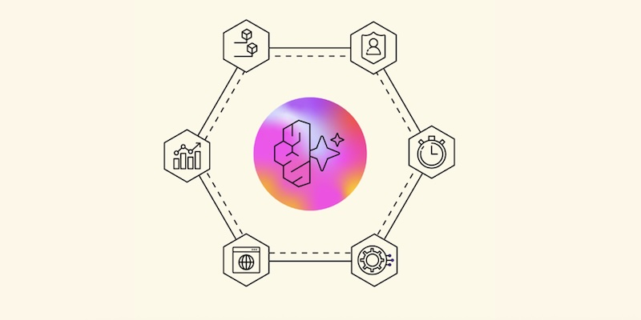
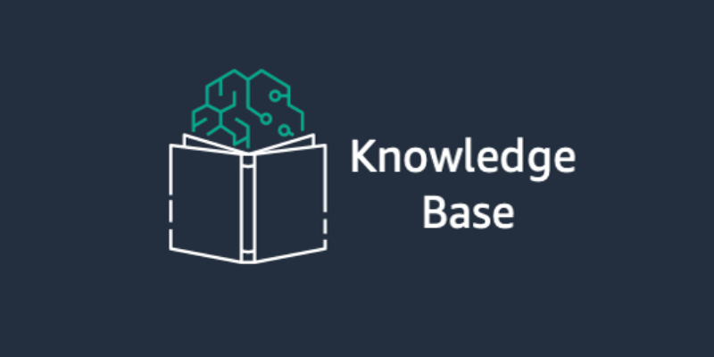
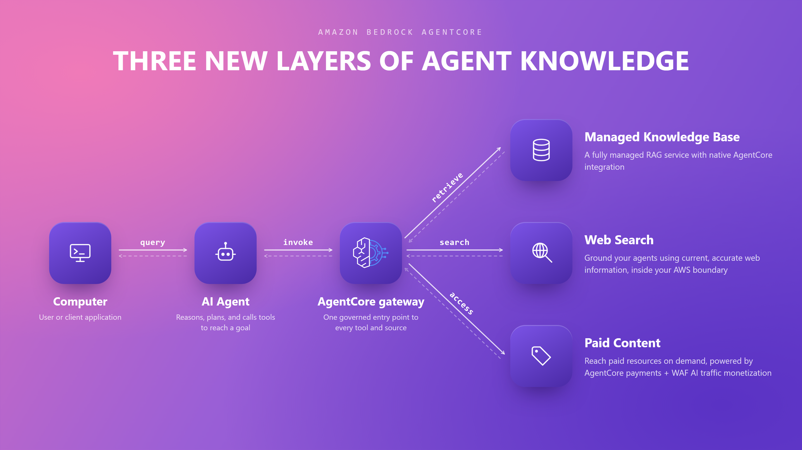
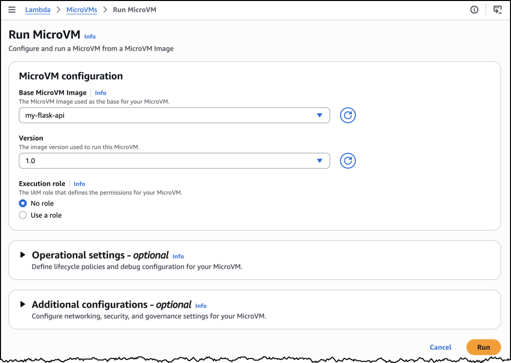
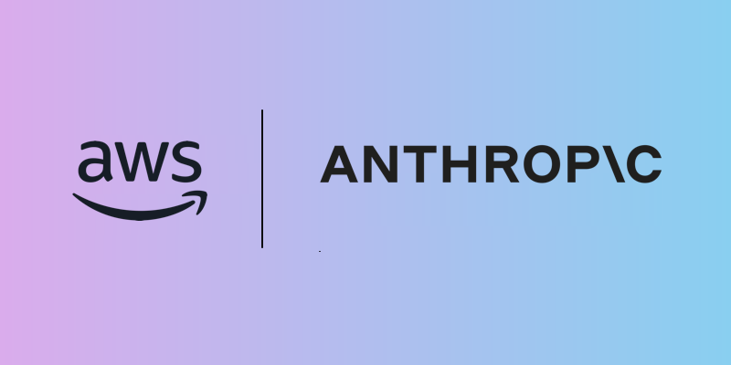
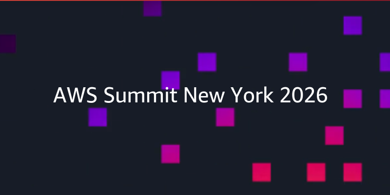

# AWS 最新ニュースまとめ
## 2026年6月号 — AWS Summit New York 2026 特集

作成日: 2026年6月24日

---

## AWS Summit New York 2026 開催

- 2026年6月17日、ニューヨークで AWS Summit が開催
- VP of Agentic AI、Dr. Swami Sivasubramanian が基調講演
- テーマは **「AIエージェントが複利的な価値を生み出す時代」**
- 主要発表は「働く・守る・作る・使う」の4つのエージェント領域に集約

> AWS のビジョン: AIエージェントを中心に据えたクラウドインフラの再設計

---

## 注目発表① Amazon Bedrock AgentCore

**AIエージェントを本番運用するための統合プラットフォーム**

| 機能 | 概要 |
|------|------|
| Web Search | 完全マネージド型Web検索。データをAWS外に出さずにエージェントを最新情報でグラウンディング |
| Managed Knowledge Base | エンタープライズRAGパイプラインをフルマネージドで構築 |
| Policy Guardrails | エージェントが成長しても守れるスケーラブルな制御機構 |
| AWS Context | 組織データをマッピングしエージェントに提供するサービス |

- **S3 Vectors 価格80%引き下げ**（大規模ベクトルインデックスのクエリコスト）

---

## 注目発表② Bedrock Managed Knowledge Base

**企業内RAGを完全マネージドで構築**

- ネイティブデータコネクタでデータソース接続を簡素化
- **Smart Parsing**: 複数フォーマットの自動データ準備
- AgentCore Gateway と統合されたエンタープライズAIアプリ向け設計

*ナレッジレイヤーのアーキテクチャ: 組織データ・Webデータ・有償データに対応*

---

## 注目発表③ AWS Lambda MicroVMs

**Firecrackerベースの新しいサーバーレスコンピューティングプリミティブ**

- VM レベルの完全分離（共有カーネルなし）
- 起動・再開がほぼ瞬時
- 状態を **最大8時間保持**して Suspend / Resume が可能
- HTTP/2、gRPC、WebSocket に対応した専用 HTTPS URL

### ユースケース
- ユーザー提供コードの安全な実行サンドボックス
- AIが生成したコードの隔離実行
- インタラクティブな開発・教育環境

**提供リージョン**: 米国東部・西部、アジアパシフィック（東京）、ヨーロッパ（アイルランド）

---

## 注目発表④ Amazon EC2 G7 インスタンス

**AWS初 — NVIDIA RTX PRO 4500 Blackwell GPU 搭載**

| スペック | 詳細 |
|---------|------|
| GPU | NVIDIA RTX PRO 4500 Blackwell Server Edition × 最大8基 |
| GPU メモリ | 最大256 GB（32 GB/GPU） |
| ネットワーク | 700 Gbps EFA（G6比 7倍） |
| AI推論性能 | G6比 **最大4.6倍** |
| グラフィクス性能 | G6比 **最大2.1倍** |

### G7e インスタンスも同時発表
- NVIDIA RTX PRO 6000 Blackwell 搭載
- G6e比 **最大2.3倍**の推論性能
- GPU メモリ 最大768 GB（96 GB/GPU）

**利用可能リージョン**: US East (Ohio)、US West (Oregon)

---

## 注目発表⑤ セキュリティ強化

**AWS Continuum — AIネイティブなセキュリティ自動化**

- コード脆弱性を環境全体から収集し、ビジネスインパクト順に優先付け
- 悪用可能な脆弱性を自動証明し、既存プロセスを通じて修正を推進
- Pull Request スキャン、IDE 統合（**Claude Code プラグイン対応**）
- 脅威モデリングを自動化（ゲートプレビュー中）

**AWS WAF — AI トラフィック収益化**

- AIボット・エージェントからコンテンツアクセスへの**課金・計量・徴収**をエッジで実現
- コンテンツプロバイダーがAIクローラーを制御・マネタイズ可能に

---

## その他の注目トピック

### 新モデル・フレームワーク
- **Claude Fable 5 on AWS** — Amazon Bedrock で Anthropic の最新モデルが利用可能
- **Grok 4.3 in Bedrock** — xAI の最新モデル、ツール呼び出し・構造化出力・ストリーミング対応
- **Strands Agents** — コンテキスト管理強化・カオステスト対応のオープンソースエージェントツールキット

### インフラ・開発者向け
- **AWS Blocks** — AWSアカウント不要でローカル開発できるオープンソース TypeScript フレームワーク
- **Amazon S3 Annotations** — オブジェクトに最大1 GB の queryable コンテキストをアタッチ（AIエージェント向け）
- **AWS Local Zone in ハノイ** — アジア太平洋で初の Local Zone、S3・EBS Local Snapshots 対応

### 価格引き下げ
- **S3 Vectors**: クエリコスト **80%削減**（大規模ベクトルインデックス）
- **GameLift Servers**: ネットワーク帯域が**無償**に（第6世代以上全インスタンス）
- **AWS Marketplace**: プロフェッショナルサービス出品手数料 2.5% → **0.5%**

---

## まとめ

### 2026年6月 AWS の3大トレンド

1. **AIエージェントのインフラ化**
   - AgentCore、Lambda MicroVMs、Strands Agents などエージェント実行基盤が充実
   - 「エージェントを作る」から「エージェントで動かす」フェーズへ

2. **Blackwell GPU の本格展開**
   - G7/G7e インスタンスにより、最先端AI推論をクラウドで即時利用可能に

3. **セキュリティ × AI の融合**
   - AWS Continuum、WAF AI トラフィック収益化でAI時代のセキュリティを再定義

### 参考リンク
- [AWS Summit New York 2026 発表まとめ](https://aws.amazon.com/blogs/aws/top-announcements-of-the-aws-summit-in-new-york-2026/)
- [AWS Weekly Roundup (2026年6月22日)](https://aws.amazon.com/blogs/aws/aws-weekly-roundup-ny-summit-recap-local-zone-in-hanoi-grok-4-3-in-bedrock-price-reductions-and-more-june-22-2026/)
- [Lambda MicroVMs 発表](https://aws.amazon.com/blogs/aws/run-isolated-sandboxes-with-full-lifecycle-control-aws-lambda-introduces-microvms/)
